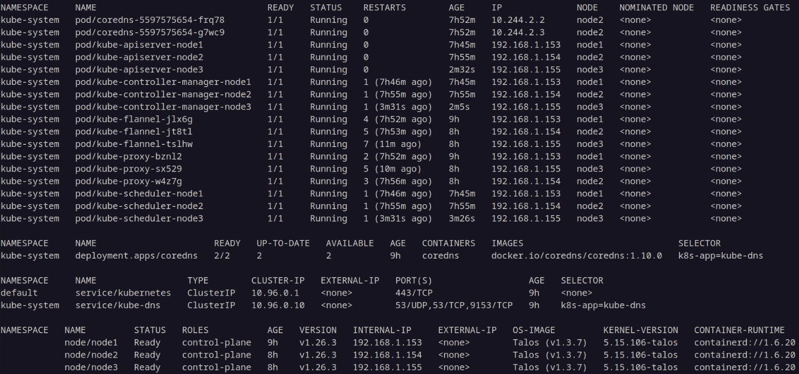

# Installing talos on a Turing Piv2 board with cm4 modules.

## Flash Nodes

I used Talos v1.3.7

### Flash image to all nodes

1) download metal-rpi_generic-arm64.img.xz from https://github.com/siderolabs/talos/releases
1) decrompress with:

```shell
xz -d metal-rpi_generic-arm64.img.xz
```

1) after putting cm4 in usb mode (use rpi cm4 emmc usb programming stick or use tpiv2, see: https://help.turingpi.com/hc/en-us/articles/8687165986205-Install-OS)
1) flash talos, this works for sd card and emmc storage. Check the correct device name.

   ```
   time xz -d < metal-rpi_generic-arm64.img.xz | sudo dd of=/dev/sda bs=1M status=progress conv=fsync
   893665280 bytes (894 MB, 852 MiB) copied, 3 s, 298 MB/s1306525696 bytes (1,3 GB, 1,2 GiB) copied, 3,82763 s, 341 MB/s

   0+152937 records in
   0+152937 records out
   1306525696 bytes (1,3 GB, 1,2 GiB) copied, 99,591 s, 13,1 MB/s

   real	1m39,600s
   user	0m3,607s
   sys	0m0,226s
   ```

1) make sure tpiv4 node is no longer in device mode, it should be host mode for normal operation.
1) optionally log in to bmc and connect to serial console of the node with minicom.

### Minicom example for node2

```shell
microcom -s 115200 /dev/ttyS1
```

### Hardwired bmc serial port connections to nodes

|Node  | bmc device |
|------|----------|
|Node 1|/dev/ttyS2|
|Node 2|/dev/ttyS1|
|Node 3|/dev/ttyS4|
|Node 4|/dev/ttyS5|

### Boot nodes

1) boot all the nodes by powering down and up using the bmc
1) optionally view disks ```talosctl -n <CM4 ipadres> disks --insecure```

## Create Cluster

### Generate cluster files

1) Generate secrets:

   ```shell
   talosctl gen secrets -o secrets.yaml
   ```

1) Generate control and worker config:

   ```shell
   talosctl gen config --with-secrets secrets.yaml "clustername" https://VIP:6443
   ```
   
   (remember chosen virtual ip VIP)

1) Edit controlplane.yaml:
   
   1) set ```controlPlane.scheduler.disabled: false```, I want control plane nodes to schedule work.
   1) add the VIP ipadress to network stanza:

      I have:
      ```
      network:
      hostname: node1
      interfaces:
         - interface: eth0
            dhcp: true
            vip:
            ip: <VIP>
      ```
   1) set ```install.disk:``` to ```/dev/mmcblk0```
   1) optionally set ```install.wipe: true```

### For each node (I have 3, an uneven number of control nodes is recommended in k8s):

1) change hostname: ```network.hostname: nodeX``` (set X to cm4 number)
1) apply config to cm4:

   ```shell
   talosctl apply-config --insecure -n <CM4 ipadres> --file controlplane.yaml
   ```

### Bootstrap cluster by one of the control nodes.

```shell
   talosctl  -n <CM4 ipadres> -e <CM4 ipadres> --talosconfig ./talosconfig bootstrap
   ```
Grab ☕

### Generate kubeconfig.

```shell
talosctl kubeconfig -f -n <VIP>

```

### Watch cluster, be happy 👏

1) ```watch -n 1.5 kubectl --kubeconfig=./kubeconfig --request-timeout=1s get pods,deployment,services,nodes -A -o wide```



### TODO

* cillium
* metallb
* ingress-nginx
* cert-manager
* external-dns
